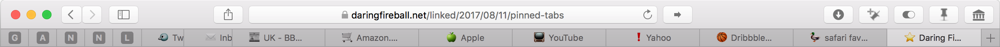

# fav*emoji*

Emoji instead of favicons in Safari.

## Why?
The Safari browser does not display favicons. You could argue that this makes it more difficult to find the content you are interested in when using tabs.

Also I thought it would be good, clean fun to use emoji to achieve a sort of favicon look in tabs. This is the result.

## Install

1. Download the extension: [favemoji.safariextz](https://github.com/gingerbeardman/favemoji.safariextension/releases/download/2018-08-16/favemoji.safariextz)
2. Double click the file to install it in Safari
3. Emoji will show up when tabs are refreshed or browsing continues

## How does it work?
`document.location.hostname` (only the domain name and subdomain) is used as the key to an array of emojis. If there's a match we prepend the emoji to the page title.

Additionally a `MutationObserver` is used to watch for changes to the page title allowing the addition of the emoji to be more robust.

The domains and emoji are stored as a JSON object that is editable in Safari > Preferences > Extensions > favemoji

### To Do
* ability for user to define their own emoji for a domain (toolbar button?)
* add exact Unicode matches for certain domains (eg. , ✪, etc.)
* add more popular domains

### Future Plans
* custom spec/meta to allow site owner to specify emoji?
* use page meta/content to best guess a relevant emoji?

#### Suggesting Emoji
If you'd like to suggest a new domain/emoji pair please include a reference to the favicon or branding that the emoji matches. A description of the reason behind the match is also useful.

#### Pull Requests Welcome
Pull Requests are welcome and will be dealt with swiftly. All help is very much appreciated!

##### License
MIT. Copyright (c) 2017 Matt Sephton @gingerbeardman

##### Change Log
2017-08-24: tries to match all parts of domain, tweaked defaults
2017-08-16: added MutationObserver and icon
2017-08-15: added Alexa Top 100 and select other sites (total ~150)
2017-08-14: initial version
